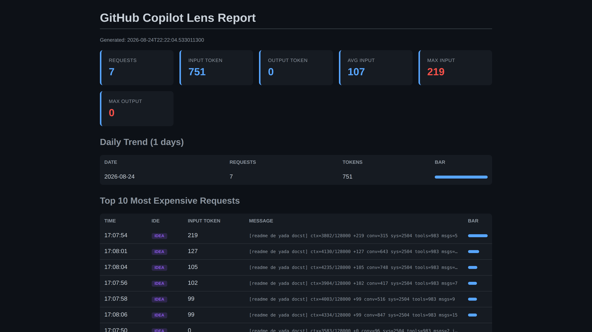

<!-- _class: title -->

# copilot-lens

## GitHub Copilot token harcamasını görünür kılan lokal CLI

**Emre Zorlu · github.com/dEMonaRE/copilot-lens**
Ağustos 2026 · Lighting talk · 15 dk



---

## Problem

Soru: Bu ay kaç premium request harcadık?

- Copilot admin dashboard → haftalık aggregate sadece
- Bireysel hesap → ay sonu özeti, anlık veri yok
- VSCode verbose log (0.60+) → prompt_tokens artık yazılmıyor

Sonuç: Geliştirici kendi prompt'larının kaç token yediğini bilmiyor. Kota ayın 2. haftasında bitiyor.

---

## TL;DR

`copilot-lens`, IDE verbose log dosyalarını okuyup lokal olarak token sayımı yapan küçük bir Java CLI aracıdır.

- Sıfır network call, sıfır telemetri
- OpenAI'nin kendi BPE'si (jtokkit, tiktoken Java portu)
- VSCode, IntelliJ, Cursor, Windsurf desteği
- Çıktı: terminal (ANSI renkli), HTML report, JSON export

---

## IDE Auto-Detect

| Log konumu | IDE |
|---|---|
| `%APPDATA%\\Code\\logs\\**\\output_logging*.log` | VSCode |
| `%LOCALAPPDATA%\\JetBrains\\**\\log\\idea.log` | IntelliJ |
| `%APPDATA%\\Cursor\\logs\\...` | Cursor |
| `%APPDATA%\\Windsurf\\logs\\...` | Windsurf |

Auto-detect: En son değişen log dosyasını otomatik seçer.

Kurulum sonrası flag gereksiz. `--ide=vscode` ile zorlanabilir.

---

## Mimari

```
IDE log (JSON veya plain text)
       |
       v
LogParser (regex tabanlı)
       |
       v
TokenCounter
   - model adından otomatik: o200k_base veya cl100k_base
   - body bulunamazsa heuristic fallback
       |
       v
StatsAggregator + Reporter
   - Terminal (ANSI) | HTML | JSON
   - Trend / Snapshot / Watch
```

Toplam disk kullanımı ~5 MB. JDK + 1 JAR.

---

<!-- _class: lead -->

## Şimdi canlı demo

Ekranı terminal'e geçiyorum.

*Gerçek log dosyası, gerçek çıktı.*

---

## Kurulum (5 dakika)

```bash
# 1. JDK 17+ gerekli (21 LTS önerilir)
java -version

# 2. Repo'yu indir
git clone https://github.com/dEMonaRE/copilot-lens.git
cd copilot-lens

# 3. Derle (jtokkit-1.1.0.jar'ı otomatik indirir)
./build.sh                # Git Bash
\\build.ps1               # PowerShell

# 4. PATH'e ekle
./copilot-lens.sh install

# 5. Çalıştır
copilot-lens              # auto-detect IDE
```

---

## Temel komutlar

| Komut | Ne yapar |
|---|---|
| `copilot-lens` | Tek seferde konsol raporu *(varsayılan)* |
| `copilot-lens watch` | Canlı izleme (RTK stili) |
| `copilot-lens gain --history` | Günlük kullanım trendi |
| `copilot-lens discover` | En pahalı prompt kalıplarını bulur |
| `copilot-lens snapshot` | Bugünün toplamını diske yazar |
| `copilot-lens trend --period=weekly` | ASCII grafik (snapshot'lardan) |
| `copilot-lens export json` | Ham veriyi JSON olarak dışa aktarır |
| `copilot-lens report` | HTML report (dark mode) |

---

## Senaryo: MCP tool avalanche

Durum: Platform ekibi açık uçlu bir prompt attı.

- "auth'u session cookieden JWT'ye çevirelim"
- Copilot Edit Agent, Bitbucket / Jira / Confluence MCP'lerine bağlandı
- 8 servis × çoklu tur = 47 request
- Her turda önceki context taşınıyor (1K → 28K token)
- copilot-lens aynı saat diliminde üst üste 8 kayıt gösterdi
- panel/editAgent provider payı %4'ten %38'e fırladı

Çözüm: Agent mode yerine edit mode, tek sorgu yeterli oldu. Aynı iş 4 request'e düştü.

Aylık tasarruf ~240 USD.

---

## How Savings Work

**RTK** agent'ın okuduğu bash çıktısını **%90'a kadar** kısar.
Bu, faturanızın %90 azalması **değil**.

Bash çıktısı input token'ların sadece bir katmanı:

```
prompt + system + history + bash output  →  input tokens
output tokens                              →  ayrı kalem
```

İndirim her katmanda seyreltir. Gerçek etkiyi ölçmek için:

- **rtk-ai** — bash çıktısı kısaltma kütüphanesi: [github.com/rtk-ai/rtk](https://github.com/rtk-ai/rtk)
- **copilot-lens** — gerçek input/output token etkisini ölçer

İkisi birlikte: *kısaltma miktarı* + *toplam token etkisi* = uçtan uca görünürlük.

---

## Kurumsal politika (IT sorularına yanıt)

| Endişe | copilot-lens |
|---|---|
| Dış servise veri | Yok. Hiçbir network call yok |
| Proxy / MITM | Yok. HTTPS'i kesmez, CA yok |
| Yönetici hakkı | Normal user process |
| Telemetri | Yok. Update kontrolü bile yok |
| Kaynak denetimi | Açık. git clone + 5 dakika review |
| KVKK / GDPR | N/A. Lokalde okur |
| Air-gapped | Tamamen çalışır |

Token ekonomisi 2026'da deney olmaktan çıktı, bütçe kalemi oldu.

---

## Linkler + Sorular

**copilot-lens**

- github.com/dEMonaRE/copilot-lens
- emrezorlu.com/2026/08/29/github-copilot-token-harcamanizi-kim-takip-ediyor
- emrezorlu.com/2026/08/08/your-ai-agents-are-quietly-failing-you-just-do-not-know-it-yet
- github.com/dEMonaRE/agent-systems-toolkit

Repo'da detaylar: INSTALL.md · USAGE.md · FEATURES.md · LOG_ACTIVATION.md

Soru ve katkı için issue veya PR açabilirsiniz.
